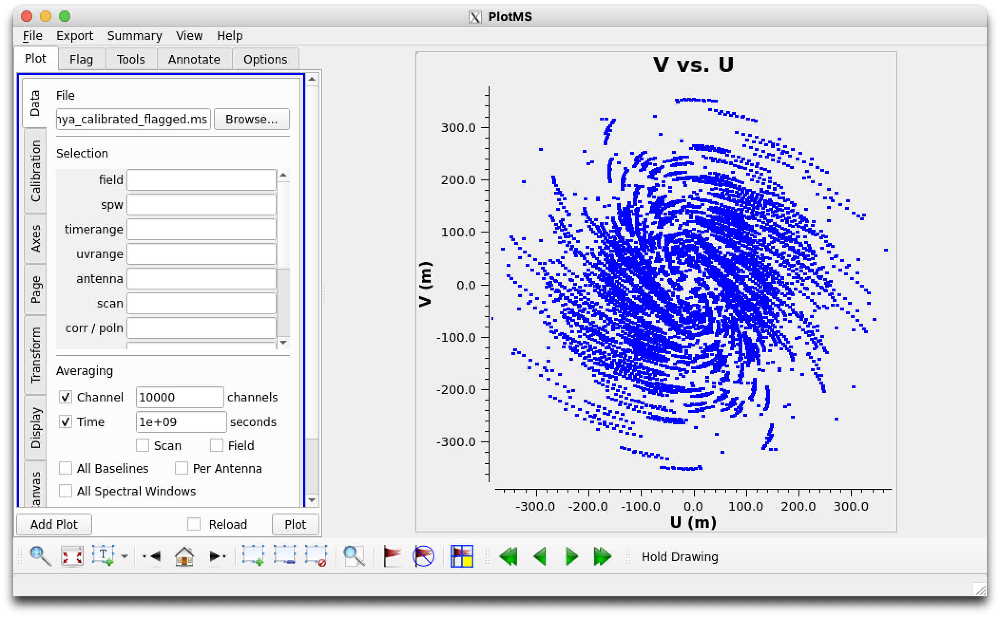
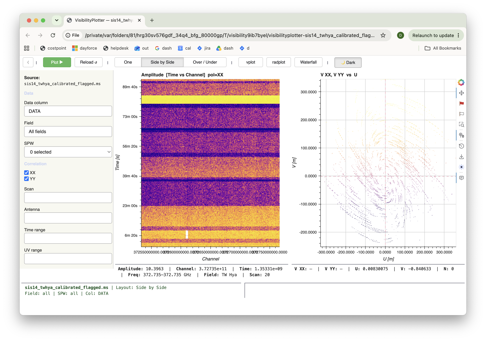

# Reference test 01 — UV coverage (u vs. v)

**Status: READY — axis blocker resolved, reduced scope (see below).**
**Kind: Scatter.**
**Methodology**: paired `plotms`/`visplot` commands against the same
local MS, same session — see `visplot-reference-testing-sources.md` §8.

## What changed since this was blocked

`visplot`'s scatter axis options previously had no `U`/`V` at all (X
had neither; Y had neither). Fixed:
- `U` was already computable server-side as an X-axis value
  (`_lazy_x_axis` in `msv2_backend.py`) but never exposed in the UI —
  now exposed, alongside several other already-working-but-unexposed
  options found during the same audit (see §10 in the master doc).
- `V` as a Y-axis *quantity* was genuinely new — `_lazy_quantity()`
  only knew `AMPLITUDE`/`PHASE`/`REAL`/`IMAGINARY` and raised
  `NotImplementedError` otherwise. Added, deliberately unmasked by
  flags (matches the existing X-axis `U`/`V` precedent — a UV-coverage
  plot should show actual sampling coverage, not current data-quality
  state).

**Still genuinely missing, not fixed by this**: a colorize-by control
(`plotms`'s `coloraxis`). No such control exists in `visplot` at all —
confirmed by searching the codebase for "colorize"/"coloraxis" and
finding nothing. So this test runs as a **shape/symmetry** comparison
only, not the full per-field-colored version the original `plotms`
reference call used.

## Commands

**`plotms`** (dropping `coloraxis="field"` from the original reference
call, since there's no `visplot` equivalent to compare it against —
this is now purely a coverage-shape check):
```python
plotms(vis='sis14_twhya_calibrated_flagged.ms', xaxis='u', yaxis='v',
       avgchannel='10000', avgspw=False, avgtime='1e9', avgscan=False)
```

**`visplot`** (explicit axis parameters, no manual GUI step — added
specifically to unblock tests like this one; see
`visplot-reference-testing-sources.md` §11):
```python
visplot(ms='sis14_twhya_calibrated_flagged.ms', scatter_x='U', scatter_y='V')
```

| `plotms` | `visplot` |
|---|---|
|  |  |

## Prediction

A symmetric UV coverage pattern — ALMA's antenna configuration should
produce point-symmetric coverage about the origin (every baseline
contributes both a (u,v) and its conjugate (-u,-v) point as the array
rotates through the observation).

## Pass criteria

Same overall coverage shape and symmetry between the two tools — same
general extent (roughly ±350m per earlier UVdist-range tests), same
point-symmetric pattern. Not expecting per-field color grouping to
match anything, since `visplot` can't produce that yet.

## Result

**PASS** on the core question — `U`/`V` compute correctly. Both tools
show the same distinctive spiral/pinwheel arm pattern, symmetric about
the origin, same rough extent (±300m). That confirms the axis values
themselves are correct, which is what this test set out to check.

**Visual density differs, with a clean explanation, not a new bug**:
`visplot`'s render looks noticeably fainter than `plotms`'s. The
`plotms` command uses `avgchannel='10000', avgtime='1e9'` — collapsing
all 48 channels to 1 and the whole observation to ~1 time bin per
baseline, so it's plotting a heavily-reduced point set. `visplot(ms=
...)` has no averaging equivalent at all (channel/time averaging for
scatter mode is a separate, already-tracked, not-yet-started gap — see
the implementation plan's Phase 3 notes), so it renders every channel
× every time sample at full resolution onto the same physical U/V
extent — many more, more finely-spread points, each getting less
per-pixel weight under Datashader's typical density-dependent
rendering. That's a density/rendering-intensity difference caused by
the averaging gap, not evidence of anything wrong with the U/V
computation itself.

**Not tested**: per-field colorization (the control doesn't exist —
see "What changed since this was blocked" above).

