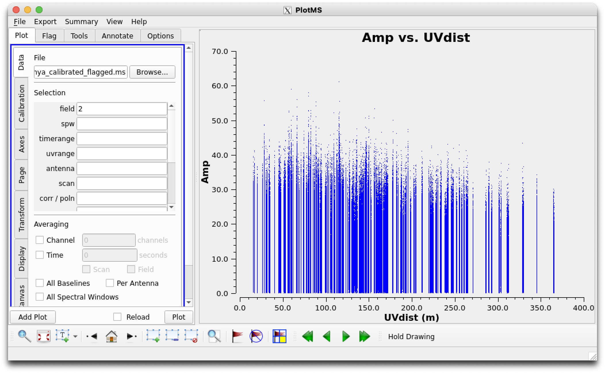
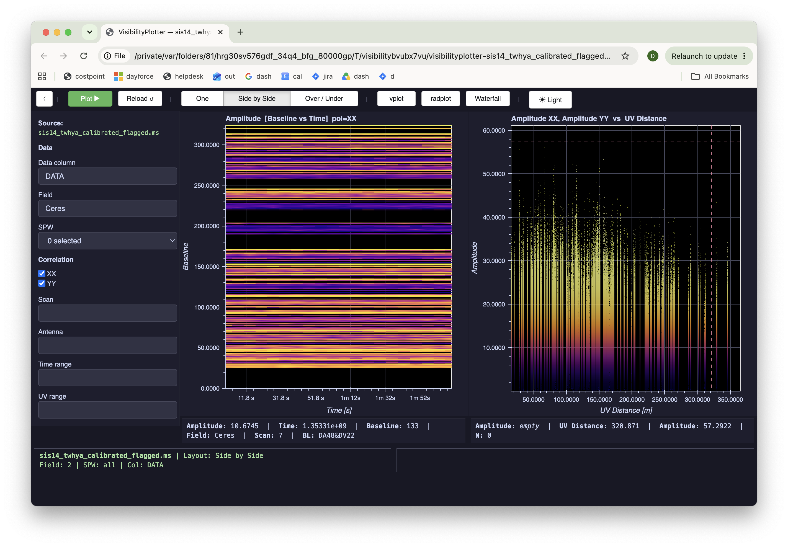

# Reference test 02 — Amp vs. UVdist, Field = Ceres (resolved source)

**Status: RESOLVED — see Result.**
**Kind: Scatter.**
**Methodology note**: this test was originally run via GUI walkthrough
against the CASA Guide's published figure (the methodology in place at
the time). That comparison surfaced a real investigation (below) which
led directly to the revised paired-command methodology now documented
in `visplot-reference-testing-sources.md` §8. Commands below are given
in the current standard format for consistency with later tests and to
make this test re-runnable as-is; the actual investigation used the
GUI-walkthrough steps this replaces.

## Commands

**`plotms`:**
```python
plotms(vis='sis14_twhya_calibrated_flagged.ms', field='2',
       xaxis='uvdist', yaxis='amp')
```

**`visplot`** (the `radplot` preset's scatter panel is exactly UVDist
vs. Amplitude — confirmed directly from `_PRESETS` in
`visibility_plotter.py`):
```python
visplot(ms='sis14_twhya_calibrated_flagged.ms', field='2', preset='radplot')
```

| `plotms` | `visplot` |
|---|---|
|  |  |

**Note (superseded — kept for history)**: this test originally had to
use `field='Ceres'` here because `visplot`'s numeric `field=` didn't
implement real `FIELD_ID` MSSelection semantics — `field='2'` resolved
to J0522-364, not Ceres, traced to `ObservationMetadata.
from_backend_metadata()` synthesizing `field_id` via `enumerate()`
over an alphabetically-sorted name list rather than reading the MS's
real (non-contiguous, 0/2/3/5/6) `FIELD_ID` values. **Fixed for
`MSv2Backend`** — see §9 for the full fix (new `_field_id_map()` in
`msv2_backend.py`, reading the `FIELD` subtable directly via `arcae`,
threaded through `reduction_context.py` and `visibility_plotter.py`).
Re-verified live on this MS (opened via `MSv2Backend`): `field='2'`
now correctly resolves to Ceres, matching `plotms`'s convention.

**`MSv4Backend`/Processing Sets are NOT fixed by this** — Processing
Sets don't have a literal `FIELD` subtable the same way MSv2 does, so
the fix above doesn't apply there at all, and this hasn't been
separately investigated. `reduction_context.py`'s fallback keeps the
old (wrong-on-non-contiguous-IDs) positional-index behavior for any
backend that doesn't supply real `field_ids` — currently that's every
Processing Set. **Numeric `field=` selection against a `.ps.zarr`
Processing Set should be treated as unreliable until this is addressed
separately**; use field names there for now, the same workaround this
test used before the `MSv2Backend` fix.

## Field context

| ID | Name | Role |
|----|------|------|
| 0 | J0522-364 | bandpass/phase cal |
| **2** | **Ceres** | flux cal — marginally resolved |
| 3 | J1037-295 | phase cal |
| 5 | TW Hya | science target |
| 6 | 3c279 | cal |

## Prediction

Ceres (field 2) is a marginally resolved Solar System body at these
baselines — amplitude should visibly **decrease** as UV distance
increases, the resolved-source visibility falloff signature.

## Pass criteria

`plotms` and `visplot` should show the same shape as each other on this
MS (per §8's revised methodology — absolute Y-axis values aren't
expected to match the CASA Guide's published figure, see Result).

## Result

**Investigation resolved — no `visplot` bug.**

Chain of evidence, in order:
1. `visplot` (Data column = DATA) showed no falloff trend, amplitude
   0–60. Did not match the guide's reference figure (smooth falloff,
   peak ~7 Jy).
2. Column mismatch — ruled out (`tb.colnames()`: only `DATA`, confirmed
   across **three independently-sourced copies** of this MS — a
   `casavis`-mirror copy, a `canfar.net`/ARC copy, and a fresh pull from
   NRAO's own canonical bulk-data link for this exact guide version).
   No `CORRECTED_DATA` in any of them.
3. SPW scope mismatch — ruled out (`SPECTRAL_WINDOW` table: 1 row,
   confirmed genuine, matches `visplot`'s dropdown).
4. Real `plotms`, run locally against this exact file (not the guide's
   published figure) — independently reproduced the same noisy,
   unscaled result `visplot` showed. Confirms the discrepancy is in the
   MS, not in either tool. (This is the check the Commands section
   above formalizes for future re-runs.)
5. **Decisive check**: `setjy(vis=..., field='2', standard='Butler-JPL-
   Horizons 2012', usescratch=True)` computed Ceres's true physical flux
   density on this MS as **7.34 Jy** — matching the guide's reference
   figure's ~7 Jy peak almost exactly. `DATA`'s actual amplitude values
   (40s–140) are 5–20x higher, which is what an uncalibrated (not yet
   on an absolute flux scale) correlator amplitude looks like, not a
   computational bug.

**Conclusion**: this MS's `DATA` column, despite "calibrated" in the
filename, was never brought onto an absolute flux scale — likely
bandpass/WVR/phase-calibrated but not amplitude-gain-calibrated. The
guide's own reference figure was generated from data at a different
calibration state (matching the true 7.34 Jy value) than what's in this
delivered file. `visplot` and real `plotms` agree with each other and
disagree with the guide's figure for the same underlying reason.

**Verdict: PASS, with a caveat.** `visplot` is correctly displaying the
actual contents of this MS — confirmed by independent agreement with
real `plotms` on the same file. The originally-planned value-level
comparison against the guide's absolute Y-axis scale isn't achievable
with this MS as currently available, and isn't a meaningful test of
`visplot` given that. Re-scope future amplitude-scale comparisons to
either (a) a version of this MS with amplitude gain calibration applied,
or (b) shape/relative-trend checks that don't depend on absolute flux
scale — which is exactly what the Commands section above now does.

**Re-verified after the `field=` numeric-selection fix** (see §9):
running the exact Commands above (`field='2'` in both tools) confirmed
live that `visplot` now correctly resolves `field='2'` to Ceres —
sidebar and hover data both show "Field: Ceres," matching `plotms`'s
`FIELD_ID=2` convention, instead of the pre-fix J0522-364 mismatch. The
two tools' plots show the same shape (noisy but genuine declining
amplitude vs. UV distance, consistent with a resolved source) and
similar Y-axis ranges (0–70 `plotms` vs. 0–60 `visplot` — the small
difference is expected, not concerning: `visplot` renders through
Datashader's pixel-binned aggregation while `plotms` draws raw
individual points, so extreme outlier tails can differ slightly between
the two without indicating a real problem). This closes the loop on
both the original calibration-state investigation and the field-id bug
discovered while re-running it in the new paired-command format.
