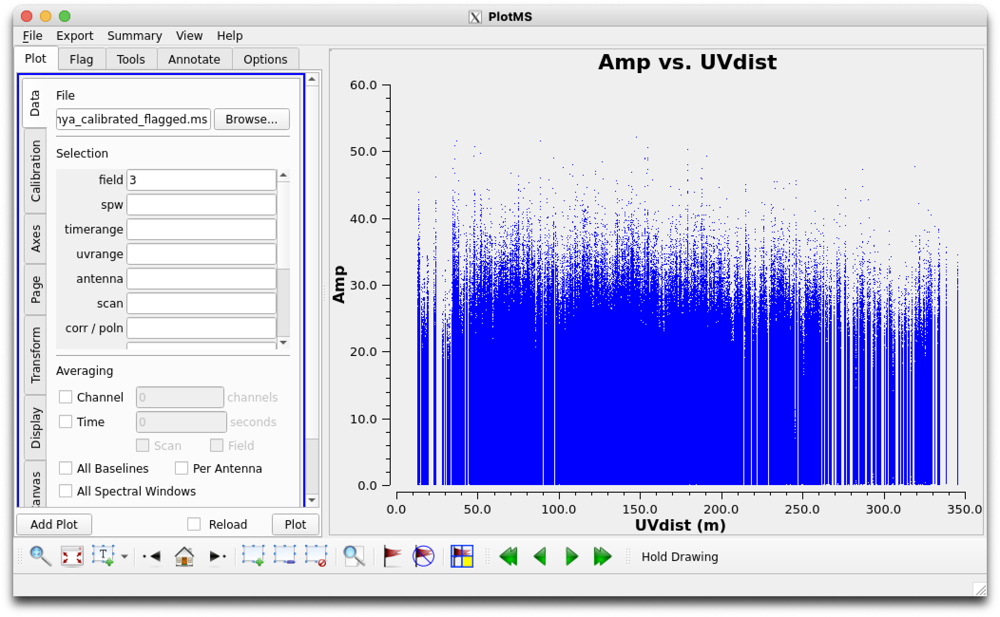
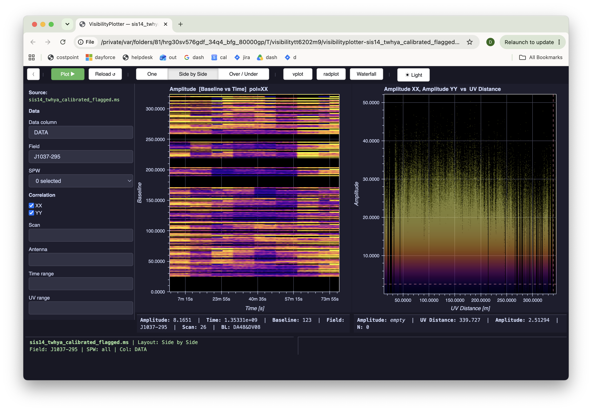

# Reference test 03 — Amp vs. UVdist, Field = J1037-295 (point-source contrast)

**Status: READY — controls confirmed present, not yet run.**
**Kind: Scatter.**
**Methodology**: paired `plotms`/`visplot` commands against the same
local MS, same session — see `visplot-reference-testing-sources.md` §8
for the full rationale (this replaces comparing against a static guide
figure, per the calibration-state issue found in test 02).

## Commands

**`plotms`:**
```python
plotms(vis='sis14_twhya_calibrated_flagged.ms', field='3',
       xaxis='uvdist', yaxis='amp')
```

**`visplot`** (same `radplot` preset as test 02, different field):
```python
visplot(ms='sis14_twhya_calibrated_flagged.ms', field='J1037-295', preset='radplot')
```

| `plotms` | `visplot` |
|---|---|
|  |  |

Uses the field name, not a numeric string — see test 02's Commands
section for why (`field=`'s numeric-string path doesn't implement real
`FIELD_ID` MSSelection semantics; names are the reliably-supported
path).

Run this alongside test 02 (field `2`, Ceres) in the same session for a
direct, back-to-back comparison — the value here is the *contrast*
between the two fields' results on the same tool, not either in
isolation.

## Field context

| ID | Name | Role |
|----|------|------|
| **3** | **J1037-295** | phase cal — compact, point-source-like |

Phase calibrators are chosen specifically for being compact/unresolved
at the observing baselines — that's what makes them usable as phase
references.

## Prediction

Amplitude vs. UV distance should be **much flatter** than Ceres's (test
02) — little to no falloff with baseline length. This is now framed as
two things to check together:
1. Do `plotms` and `visplot` agree with each other on J1037-295's shape?
   (the real correctness question, per the revised methodology)
2. Does J1037-295's shape look flatter than Ceres's, in *both* tools?
   (the physical prediction, checked consistently across both)

## Pass criteria

`plotms` and `visplot` should show the same shape as each other for
J1037-295, and that shape should look flatter than either tool's Ceres
result from test 02. Absolute Y-axis values aren't expected to match
any external reference (per the §7/§8 caveat) — only internal
consistency between the two tools and the two fields.

## Result

**PASS.** Both criteria confirmed:

1. **`plotms` and `visplot` agree with each other on J1037-295's shape**:
   both show a fairly flat, noisy amplitude band across the full UV
   distance range (0–330m), no dramatic decline. Y-axis ranges close
   (0–60 `plotms`, 0–50 `visplot`) — the same small gap seen in test 02,
   attributable to Datashader's pixel-binned aggregation vs. `plotms`'s
   raw point rendering, not a correctness concern.
2. **J1037-295 looks flatter than Ceres, in both tools**: comparing
   directly against test 02's results, Ceres showed a real decline from
   ~50–60 down to ~20–30 across the UV distance range in both tools;
   J1037-295 stays much more level throughout in both. This matches the
   physical prediction (phase calibrators are chosen for being compact/
   unresolved at the observing baselines) and is a genuine cross-field,
   cross-tool consistency check, not just "does this look plausible" in
   isolation.

Field selection used the name (`J1037-295`) rather than the now-fixed
numeric form (`field='3'`) — both are reliable for `MSv2Backend` as of
the fix in §9, this test simply predates switching test 02's command
back to numeric. No need to re-run with the numeric form; either path
exercises the same underlying selection logic post-fix.

