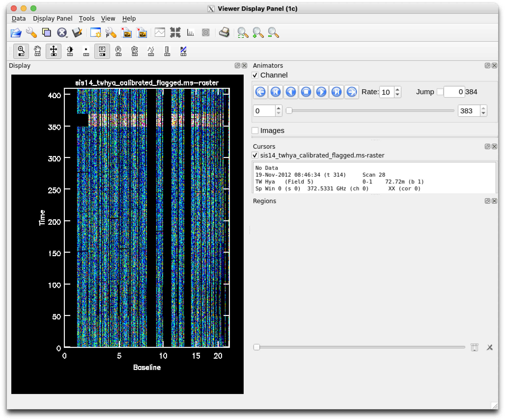
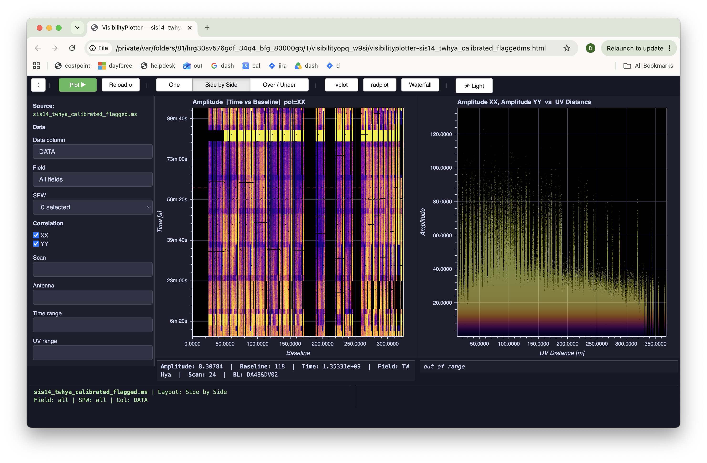

# Reference test 04 — Time vs. Baseline raster, all fields

**Status: READY — not yet run.**
**Kind: Raster.** First raster-side reference test — scatter has three
(tests 01–03), raster has none until now.
**Methodology**: paired `msview`/`visplot` commands, but genuinely
asymmetric — see below.

## IMPORTANT — not a strict one-to-one comparison

Discovered while setting up test 05 (Time vs. Channel): `msview` and
`visplot` handle axes beyond the two displayed ones completely
differently. `msview` **animates** through the remaining axis
(Baseline, in this test) one frame at a time via its Animator panel —
it does not average. `visplot`'s raster **averages** over whatever axes
aren't displayed (confirmed directly in `query_raster()`'s own
docstring: "average over frequency (and pol)" for this axis pair). So
strictly speaking, the `msview` screenshot below shows one arbitrary
Channel/Correlation frame, while the `visplot` screenshot shows a full
average across all channels and both correlations — not the same
underlying reduction, even though both are labeled "Time vs. Baseline."

This caveat applies retroactively to the comparison below. It does
**not** invalidate the bug fix — that was confirmed independently by
reading `query_raster()`'s actual code and reproducing the exact
failure mechanism synthetically (see Result), not solely by the two
screenshots visually matching. But the visual "notch position" match
that motivated the investigation was never a rigorous one-to-one check,
and shouldn't be read as one in hindsight.

## A real asymmetry, not a parity comparison

Checked `msview`'s actual scriptable parameters before writing this:
`msview(infile, displaytype, channel, zoom, outfile, outscale, outdpi,
outformat, outlandscape, gui)` — no axis or data-selection parameters
at all. Every CASADocs source agrees: *"Settings (e.g., axes) can then
be manually adjusted using the interactive Viewer Display Panel."*
Unlike `plotms`, there's no way to specify Time-vs-Baseline vs.
Time-vs-Channel from the command line — that's GUI-only. (There's a
`.rstr` restore-file mechanism for reloading a previously-configured
state, useful for *repeat* runs once set up once, not for first setup.)

So this test's `msview` side needs manual GUI steps; its `visplot` side
is fully parameterized, thanks to the explicit axis parameters added in
§11.

## Commands

**`msview`**:
```python
msview(infile='sis14_twhya_calibrated_flagged.ms')
```
Then in the Data Display Options panel: set display axes to Time
(Y) vs. Baseline (X) — `msview`'s own documented default, per the VLA
CASA Flagging guide (confirms Time-vs-Baseline as the default raster
view). No field/scan restriction — all fields.

**`visplot`**:
```python
visplot(ms='sis14_twhya_calibrated_flagged.ms',
        raster_y='TIME', raster_x='BASELINE', raster_qty='AMPLITUDE')
```

| `msview` | `visplot` |
|---|---|
|  |  |

## Prediction

This MS has 5 fields observed in sequence within one session (bandpass/
phase cal, flux cal, phase cal, science target, another cal — see test
02/03's field table), each occupying a contiguous time range. Both
tools should show **distinct horizontal amplitude bands along the Time
axis**, corresponding to these field/scan transitions — not a specific
physical number to match (no averaging control on either side makes
exact value comparison unreliable, per test 01/02's findings), but a
structural pattern that should show up the same way in both. 325
baselines confirmed directly from `MSv2Backend.metadata()` earlier in
this conversation (`n_baselines`), not from the possibly-inaccurate
"43 antennas" figure in earlier notes — 26 real antenna names were
returned, C(26,2) = 325, consistent.

## Pass criteria

Same banding structure along Time in both tools — same rough number of
bands, same rough relative brightness pattern (bright bands = higher-
amplitude calibrators, e.g. Ceres; darker bands = fainter target
field). Not expecting exact pixel/value match, per the established
"shape/structure, not absolute value" approach from the scatter tests.

## Result

**Initial run: real bug found, not a display-convention artifact.**

Both renderings show a small dark/flagged "notch" — but at different
relative Time positions. `msview`: near the *latest* times (top of its
Y-range). `visplot`: near the *earliest* times (bottom of its Y-range).
Both tools' Y-axes independently confirmed to increase upward from
their tick label positions, ruling out a simple axis-orientation
explanation — this is a genuine ordering difference, not a display
convention mismatch.

**Root cause, confirmed by reading `query_raster()` in
`msv2_backend.py`**: this MS has 4 partitions (bandpass-cal, amplitude-
cal, phase-cal, target — split by intent/`OBS_MODE`, confirmed much
earlier in this conversation). `xr.concat(partitions_2d, dim=y_name,
...)` concatenated them in `_iter_visibility_partitions()`'s iteration
order — reflecting how they were split, not necessarily ascending time
order — with **no `.sortby()` anywhere in the function**. Any intent
revisited at non-contiguous times (e.g. a phase calibrator checked
periodically through the observation — a normal ALMA cadence) lands in
one partition spanning a non-contiguous time range; concatenating it as
a single contiguous block scrambles true chronological order in the
result. `msview`, reading the MS table directly rather than through
this intent-partitioned structure, wouldn't hit this at all — which is
exactly why the same underlying data (and the same "notch" feature)
landed in different relative Time positions in the two tools.

**Fix**: `agg = agg.sortby(sort_dims)` added right after the concat,
applied unconditionally (both single- and multi-partition cases) as a
defensive guarantee. Verified against a synthetic scenario shaped
exactly like the real bug (4 partitions, one with a non-contiguous time
range, in non-chronological iteration order) — confirmed monotonic time
order restored, zero data loss (60/60 samples present both before and
after sorting, only the order changed). See §12 in the master doc.

**Real, confirmed bug fix — verified independently of the visual
comparison's rigor.** The partition-ordering fix itself stands on its
own: found by reading `query_raster()`'s actual code, reproduced
synthetically with a scenario shaped exactly like the real failure, and
the live re-verification (notch landing in the same relative position
in both tools post-fix) is consistent with — though not a rigorous
proof of — the fix working correctly, given the animate-vs-average
caveat above means the two screenshots were never strictly comparable
to begin with.

**Not calling this a clean "PASS" on raster/`msview` parity** — that
would overclaim what this test actually established. What it did
establish: a real bug, correctly diagnosed and fixed, confirmed via
code-level evidence rather than screenshot-matching alone. Direct
raster-vs-`msview` comparison as a testing methodology needs the
animate-vs-average difference resolved (or at least an agreed-on way to
make the two comparable, e.g. picking a single Channel/Corr frame on
`visplot`'s side too, once that's possible) before further tests like
this can produce a meaningful pass/fail on structure, not just catch
bugs incidentally the way this one did.

