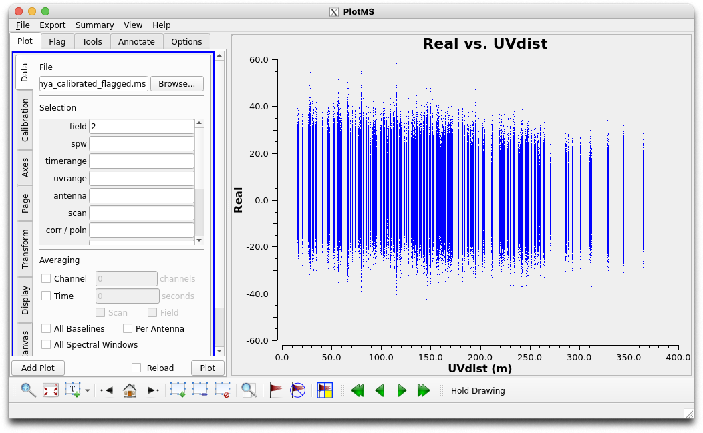
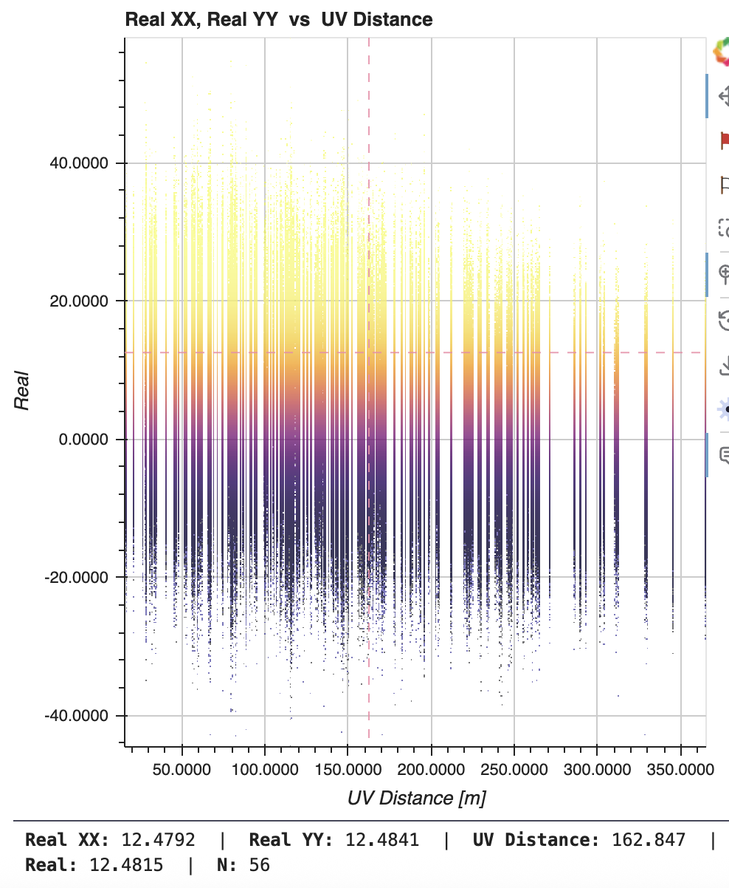
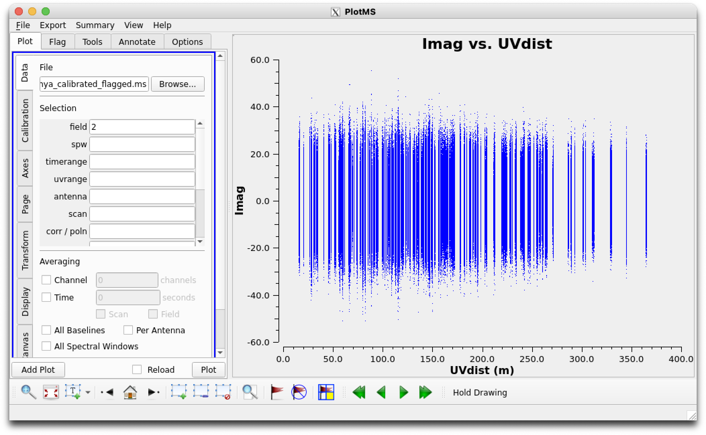
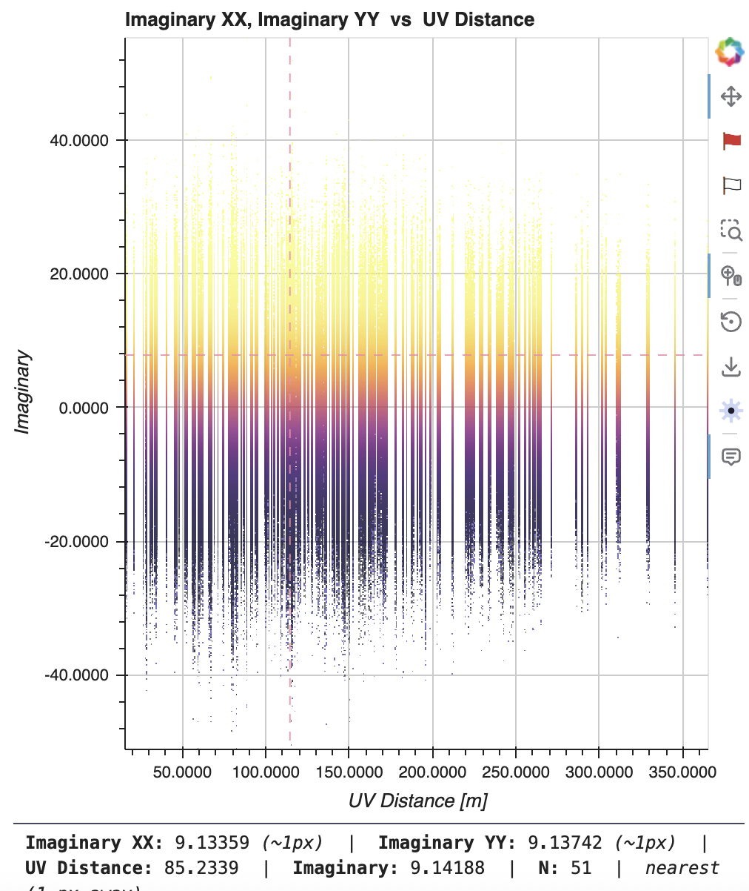

# Reference test 06 — Real and Imaginary as scatter Y-axis values

**Status: READY — not yet run.**
**Kind: Scatter.**
**Methodology**: paired `plotms`/`visplot` commands, same construction-
parameter approach as tests 01–03 — no GUI interaction, so this stays
valid regardless of any future grid/iteration-mode changes to the GUI
itself (see conversation context: GUI-interaction testing is being
deliberately held back for that reason, this test doesn't touch it).

## Why this specific pair

`REAL`/`IMAGINARY` were added to `visplot`'s exposed scatter Y-axis
options in the §10 audit, alongside `AMPLITUDE`/`PHASE` (already
live-tested, tests 02/03) and `U`/`V` (already live-tested, test 01 —
`V` was used as Y-axis there). `REAL`/`IMAGINARY` are the two axis
options from that audit that have only been verified via code-reading
and a synthetic, fabricated-data test (`_lazy_quantity`, bound and
called directly against manufactured arrays) — never against the real
MS, never compared to `plotms`. This closes that gap.

## Commands

**`plotms`** (Real):
```python
plotms(vis='sis14_twhya_calibrated_flagged.ms', field='2',
       xaxis='uvdist', yaxis='real')
```

**`visplot`** (Real):
```python
visplot(ms='sis14_twhya_calibrated_flagged.ms', field='2',
        scatter_x='UVDIST', scatter_y='REAL')
```

| `plotms` | `visplot` |
|---|---|
|  |  |

**`plotms`** (Imaginary):
```python
plotms(vis='sis14_twhya_calibrated_flagged.ms', field='2',
       xaxis='uvdist', yaxis='imag')
```

**`visplot`** (Imaginary):
```python
visplot(ms='sis14_twhya_calibrated_flagged.ms', field='2',
        scatter_x='UVDIST', scatter_y='IMAGINARY')
```

| `plotms` | `visplot` |
|---|---|
|  |  |

Field 2 (Ceres) chosen for continuity with test 02, not because
anything here depends on which field — any field would do.

## Prediction

Two things to check, one qualitative and one genuinely quantitative:

1. **Shape**: `plotms` and `visplot` should agree with each other on
   the Real and Imaginary distributions (same approach as every prior
   scatter test — agreement between the tools, not a match to any
   external absolute-value reference, per the calibration-state caveat
   in §7).
2. **Internal consistency check** (the more decisive one — ties back to
   already-validated data rather than depending only on visual
   agreement): for the same selection, `Real² + Imaginary²` should
   equal `Amplitude²`, since that's the actual mathematical
   relationship between these quantities for any given visibility.
   Amplitude for this exact selection (Field 2, UVDist) was already
   validated in test 02. If `visplot`'s Real/Imaginary values are
   correct, this identity should hold when checked against a handful of
   points read off both plots (e.g. via hover/cursor readout) — not
   just "the scatter looks reasonable."

## Pass criteria

- `plotms`/`visplot` agree on shape for both Real and Imaginary.
- Spot-checking a few points: `sqrt(Real² + Imaginary²)` ≈ the
  Amplitude value at the same (or a comparable) UVDist, consistent with
  test 02's already-established Amplitude behavior for this field.

## Result

**Interim finding — resolved, not a computation bug.** Initial
light-mode screenshot of `visplot`'s Real-vs-UVdist made the
distribution look asymmetric (clipped near 0, not extending negative)
compared to `plotms`'s roughly symmetric ±60 range. Switching `visplot`
to dark mode revealed the same plot actually does extend symmetrically
to about -40 — the negative-Real tail (sparser, lower point density)
was rendering too faintly to see against the light-mode background.
**Display legibility issue, not a data/computation bug** — logged per
the "fix as encountered" approach already agreed for dark/light-mode
issues generally, not treated as urgent.

Separately noted, minor and unrelated: the hover readout's numeric
formatting shows four trailing decimals (e.g. "14.7431"), more
precision than useful for reading by eye — cosmetic only, not pursued
now.

**Still to do**: the actual quantitative check this test was built
around — `Real² + Imaginary² = Amplitude²` at a few spot-checked
points — hasn't been done yet, and the Imaginary comparison hasn't been
run at all. The asymmetry scare turning out to be a display artifact is
good news, but doesn't substitute for it.

**Real bug found while trying to spot-check points**: hovering a
visibly-rendered (colored) point showed `N: 0` in the readout, and
didn't change moving around nearby. Traced to `probe_scatter_pixel()`
in `msv2_backend.py`: the pixel's half-width for counting nearby raw
samples was computed as `(x_coords[-1]-x_coords[0]) / (2*len(x_coords))`
— dividing by the bin *count* instead of the true center-to-center
spacing (`2*(len-1)`). This produces a probe window measurably
*narrower* than Datashader's actual bin edges (confirmed: ~5% narrower
in a synthetic reproduction), so a pixel can have a real, non-NaN
rendered value while the independently-recomputed sample count for
that same pixel comes up empty — exactly the reported symptom. The
identical formula, same bug, was also found copy-pasted into
`probe_raster_pixel()` (the raster hover tooltip's Field/Scan/BL
attribution) and fixed there too, though without the same
directly-visible `N=0` symptom to catch it.

**Status: RESOLVED — externally, outside this conversation.** The
`_handle_probe`/pixel-to-data-skew issue was fixed in a separate
session not tracked in this document. Kept the investigation history
above as-is rather than rewriting it, since it's a real record of how
the bug was actually found and diagnosed — just noting here that it's
closed.

**`Real² + Imaginary² = Amplitude²` — confirmed, at the raw-data level,
not yet at the rendered level.** Cross-tool point-matching via hover
turned out not to be viable (see below) — three independent `visplot`
launches can't be made to land on the same visibility by eye, since UV
distance resolves to three decimal places. Worked around it by reading
one exact, known raw visibility directly from the MS instead of hunting
for a match in the GUI:

```
field=2 (Ceres), row=0, chan=0, corr=XX:
  complex value: (11.14268684387207+15.501862525939941j)
  Real: 11.1427   Imaginary: 15.5019   Amplitude: 19.0910
  Real² + Imag² = 364.4672   Amplitude² = 364.4672   (exact match)
```

This confirms the mathematical relationship holds for the underlying
data (trivially true by construction, but establishes a known,
citable reference value for this exact visibility — reusable without
re-deriving if this needs revisiting). What it does **not** yet confirm
is whether `visplot`'s own Real/Imaginary/Amplitude scatter renders
correctly reproduce this same value for this same point through the
full pipeline (query → Datashader aggregation → rendering → hover
readout) — deferred, not pursued further in this preliminary phase.

**Two real findings from this investigation, both open, neither
chased further right now:**

1. **Y-axis auto-ranging may not recompute per-quantity.** An Imaginary
   view appeared completely empty ("no data", fully black) at a Y-axis
   window of 49–53 — which turned out to be squarely within *Real*'s
   value range, not Imaginary's (Imaginary's actual range is roughly
   -45 to +45, confirmed once viewed at full extent, where it showed a
   normal, dense distribution). Suggests the Y-axis range may not have
   been freshly computed for the new quantity when switching. Not
   confirmed whether this was a fresh-launch bug or a reused-tab
   stale-state artifact — genuinely unresolved.
2. **No way to precisely relocate the same data point across
   independently-launched views.** UV distance hover resolves to three
   decimal places, and there's no mechanism to pin a specific point and
   find it again in a different launch — a real, standalone UX gap
   surfaced by trying to do this cross-tool comparison at all, distinct
   from any specific quantity's correctness.

Both are worth tracking for whenever this area gets revisited — not
blocking for this preliminary phase, and not something to chase further
without fresh source given the note that source has moved since the
pixel-skew fix.

